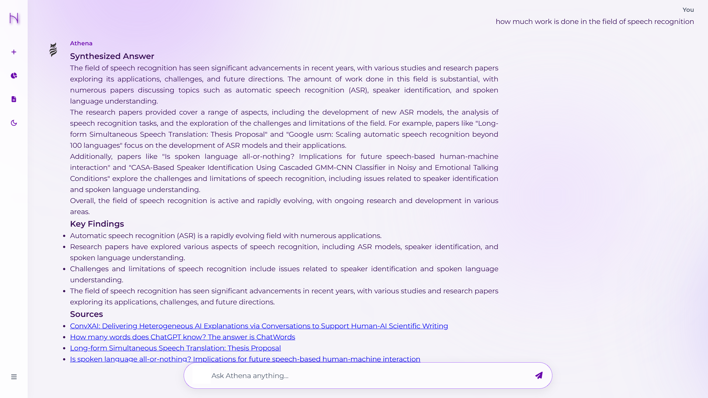
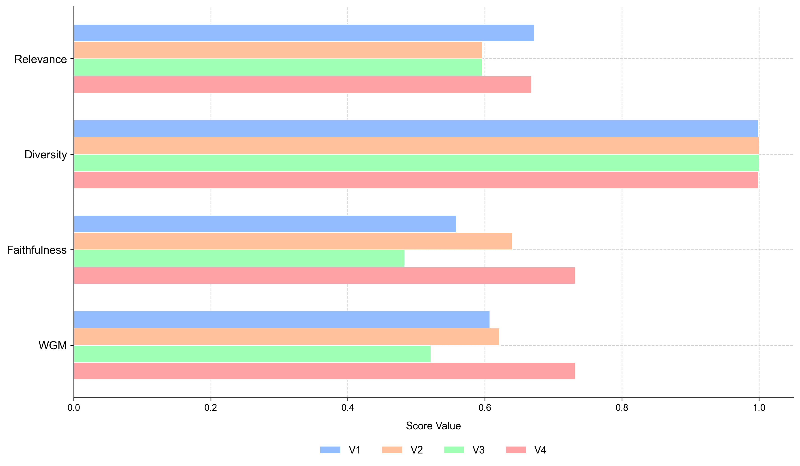

# Scholarly-Epistemic-Engine: A Four-Stage RAG System for Semantic Knowledge Elicitation

[](https://opensource.org/licenses/MIT)
[](https://huggingface.co/datasets/[YOUR_USERNAME]/[YOUR_DATASET])
[](#)

## Overview

This repository contains the source code and execution environment for the paper: **"A Four-Stage Retrieval-Augmented Generation System for Semantic Knowledge Elicitation"**. 

The Scholarly-Epistemic-Engine is an advanced Retrieval-Augmented Generation (RAG) framework designed to address information overload in scientific literature. By orchestrating a vast corpus of nearly 90,000 arXiv cs.AI papers (1993–2024), this system transitions from a baseline naive RAG (V1) to a highly optimized, faithfully grounded synthesis engine (V4) utilizing query expansion, cross-encoder reranking, and Large Language Model (LLM) fusion.

> **Note on Data Availability:** The execution scripts and framework are hosted here. The full 50+ GB processed dataset and pre-computed ChromaDB vector embeddings are hosted separately on Hugging Face. See the [Data Availability](#data-availability) section for access.

---

The framework is built on a progressive four-stage evolution:
1. **V1 (Naive RAG):** Direct retrieval and standard context generation.
2. **V2 (Query Rewriting):** LLM-based query optimization for enhanced semantic matching.
3. **V3 (Dynamic Prompting):** Structured synthesis enforcing markdown formatting and verifiable, clickable sources.
4. **V4 (Advanced Fusion):** Multi-query expansion, over-fetching (40 chunks), cross-encoder reranking (top 20), and LLM-guided adaptive fusion (top 10).

---

## Repository Structure

The repository is organized to reflect the discrete phases of the methodology:

```text
.
├── LICENSE
├── README.md
├── data_pipeline/               # Phase 1-3: Offline Data Preparation
│   ├── meta_data_fetch.py       # Resumable arXiv API metadata scraping
│   ├── data_processing.ipynb    # Stateless PDF extraction and text cleaning
│   ├── full_text_data_creation.ipynb 
│   ├── vectorization.py         # Embedding generation and ChromaDB indexing
│   └── *_logs.txt               # Output logs for data operations
├── LLM_connection/              # Phase 4: The 4-Stage RAG Engine
│   ├── rag_connection_v1.py     # Naive RAG implementation
│   ├── rag_connection_v2.py     # Query rewriting pipeline
│   ├── rag_connection_v3.py     # Sourced synthesis pipeline
│   ├── rag_connection_v4.py     # Full cross-encoder reranking & fusion pipeline
│   └── logv*.txt                # Execution logs for each RAG variant
├── results_and_analysis/        # Output Artifacts and Metrics
│   ├── sample_llm_result.md     # Markdown output sample
│   ├── sample_llm_result.pdf    
│   └── yearly_publications_plot.png # Exploratory Data Analysis visuals
├── testing/                     # Evaluation Framework
│   └── testing_logs.txt         # Relevance, Diversity, and Faithfulness metrics
└── web_module/                  # User Interface
    ├── app.py                   # Web application routing
    ├── static/                  # Static assets (logos, CSS)
    └── templates/               
        └── chatbot.html         # Front-end GUI for the RAG system

```

---

## Data Availability

To ensure full reproducibility, the implementation materials and datasets supporting this study have been made publicly accessible.

* **Codebase:** The extraction scripts, vectorization code, and RAG execution environments are available in this repository.
* **Dataset & Embeddings:** The complete processed corpus (87,984 manuscripts, 7.49 million chunks) and the pre-computed `all-mpnet-base-v2` ChromaDB vectors (>50 GB) are hosted on Hugging Face.

**Access the dataset here:**  

[🤗 Hugging Face Dataset – Scholarly-Epistemic-Engine](https://huggingface.co/datasets/whyamanbhardwaj/Scholarly-Epistemic-Engine)

---

## Installation and Setup

**1. Clone the repository:**

```bash
git clone [https://github.com/GitHub-AmanBhardwaj/Scholarly-Epistemic-Engine.git](https://github.com/GitHub-AmanBhardwaj/Scholarly-Epistemic-Engine.git)
cd Scholarly-Epistemic-Engine

```

**2. Install dependencies:**
Requires Python 3.9+. It is recommended to use a virtual environment.

```bash
pip install -r requirements.txt

```

**3. Download the Vector Database:**
Download the `chroma_db` directory from the Hugging Face dataset link and place it in the root directory of this repository to bypass the 40+ hour vectorization process.

---

## Usage Guide

### 1. Running the RAG Pipeline locally

You can test the individual RAG versions using the scripts in the `LLM_connection` directory. Ensure your local GPU environment is properly configured for Llama-3 inference.

```bash
cd LLM_connection
python rag_connection_v4.py

```

### 2. Launching the Web Interface

To interact with the system via the GUI developed for this study:

```bash
cd web_module
python app.py

```



*Figure 2: The interactive web interface demonstrating structured markdown output and verifiable sources.*

---

## Evaluation Results

The system was evaluated using an information-theoretic framework measuring **Relevance** (Mean Similarity), **Diversity** (Shannon Entropy), and **Semantic Faithfulness** (LLM-as-a-Judge). The V4 pipeline demonstrated the highest capacity to mitigate hallucinations while maintaining robust semantic alignment.



*Figure 3: Comparative performance analysis of the four RAG variants.*

Detailed testing logs and metric outputs can be found in `testing/testing_logs.txt`.

---

## License

* **Code:** The source code in this repository is licensed under the **MIT License**.
* **Data:** The dataset and vector embeddings hosted on Hugging Face are licensed under **CC-BY-NC-SA 4.0** for academic and non-commercial research purposes.
